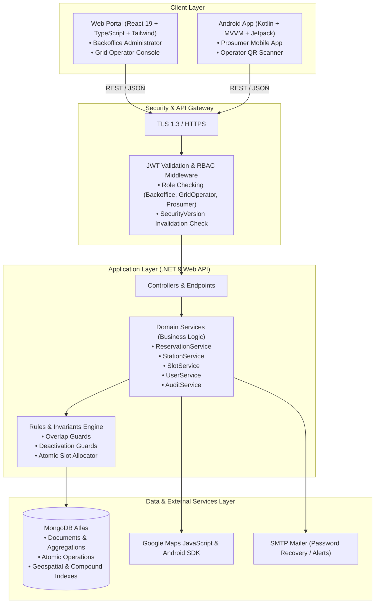
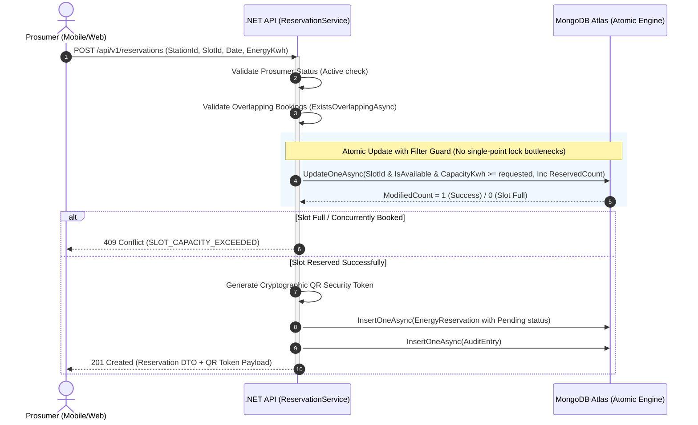
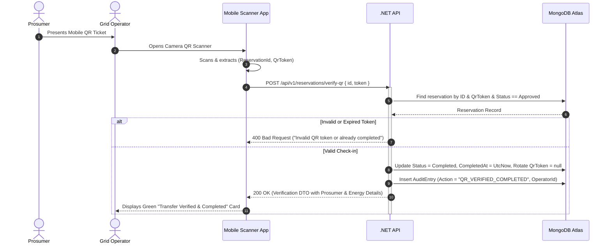

# SolarGridX — System Architecture & Technical Design

This document details the architectural blueprint, layered design, integration boundaries, security protocols, and operational workflows of **SolarGridX**.

---

## 1. System Overview & C4 Architecture

SolarGridX is an enterprise-grade Smart Solar Microgrid Management Platform connecting **Backoffice Administrators**, **Grid Operators**, and **Prosumers** (solar producers/consumers) with real-time slot booking, telemetry, and cryptographic QR check-in capabilities.



---

## 2. Layered Clean Architecture (.NET 9 API)

The backend follows Clean Architecture principles with explicit separation of concerns:

```
MicrogridApi/
├── Configuration/       # Strongly typed options (MongoDbSettings, JwtSettings, EmailSettings)
├── Controllers/         # REST API Controllers (Auth, Users, Stations, Slots, Reservations, Dashboard)
├── DTOs/                # Request/Response Data Transfer Objects with validation annotations
├── Middleware/          # Global Exception Handler (RFC 7807 ProblemDetails), JWT Auth & Auditing
├── Models/              # MongoDB BSON Domain Entities (User, SolarStationInfo, EnergyReservation, etc.)
├── Services/            # Business Logic & Orchestration (ReservationService, StationService, etc.)
└── Program.cs           # Dependency Injection container, Swagger setup & Seeder pipeline
```

---

## 3. Key Operational Sequence Diagrams

### 3.1 Atomic Solar Slot Reservation & Concurrency Control



---

### 3.2 QR Code Check-in & Power Transfer Lifecycle



---

## 4. Security & Identity Architecture

### 4.1 Token Revocation & `SecurityVersion` Pattern
1. Every user document maintains an integer `SecurityVersion` (initialized to `1`).
2. When a JWT is minted, `sec_v: User.SecurityVersion` is embedded into the claims.
3. On password changes, profile deactivations, or administrative revocations, the backend executes:
   $$\text{User.SecurityVersion} \leftarrow \text{User.SecurityVersion} + 1$$
4. The JWT authentication middleware checks `claim.sec_v == current_user.SecurityVersion`. Any token issued prior to the password change is instantly rejected across all devices without maintaining heavy in-memory sessions.

---

## 5. Client Applications Architecture

### 5.1 Web Client (React 19 + TypeScript)
* **Design System**: Modern high-density dashboard tokens using Tailwind CSS v4.
* **State & Data Fetching**: Custom `useApiQuery` and `useApiMutation` hooks with `AbortController` cancellation support.
* **Component Kit**: Native SVG Donut & Bar Charts, responsive drawers, command palettes (`Ctrl+K`), and Google Maps JS Loader.

### 5.2 Mobile Client (Android Kotlin)
* **Architecture**: Single-Activity Pattern (`MainActivity`) with Jetpack Navigation Graphs (`nav_auth`, `nav_stations`, `nav_reservations`, `nav_scan`).
* **MVVM Pattern**: ViewModels managing live UI states via Kotlin Coroutines and StateFlow.
* **Hardware Integration**: CameraX for real-time QR code decoding, Google Play Services Location for proximity calculations.
