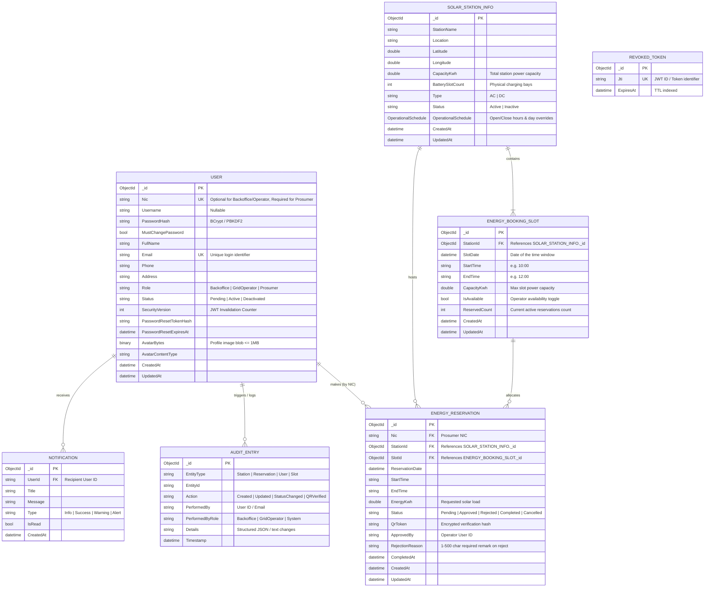

# SolarGridX — Database & Entity Architecture Specification

This document provides the complete database design, Entity-Relationship (ER) diagram, document schemas, index strategies, and concurrency control models for **SolarGridX**.

---

## 1. Entity-Relationship (ER) / Document Model Diagram



---

## 2. MongoDB Collections Specification

### 2.1 Collection: `Users`
Stores authentication credentials, profile data, roles, and password recovery tokens for all system actors.

| Field | BSON Type | Nullable | Constraints & Description |
|---|---|:---:|---|
| `_id` | `ObjectId` | No | Primary Key. |
| `Nic` | `String` | Yes | National Identity Card number. Required for Prosumers. |
| `Username` | `String` | Yes | Optional display identifier. |
| `PasswordHash` | `String` | No | Secure salted hash. |
| `MustChangePassword` | `Boolean` | No | `true` for newly provisioned staff until first login. |
| `FullName` | `String` | No | Display name (1–100 chars). |
| `Email` | `String` | Yes | Unique login identifier. Validated RFC 5322 email. |
| `Phone` | `String` | Yes | Contact phone number. |
| `Address` | `String` | Yes | Residential or facility address. |
| `Role` | `String` | No | Enum: `Backoffice`, `GridOperator`, `Prosumer`. |
| `Status` | `String` | No | Enum: `Pending`, `Active`, `Deactivated`. |
| `SecurityVersion` | `Int32` | No | Incremented on password changes to immediately invalidate old JWT tokens. |
| `PasswordResetTokenHash` | `String` | Yes | SHA-256 hash of emailed reset token. |
| `PasswordResetExpiresAt` | `Date` | Yes | Expiration timestamp for reset token (typically 30 mins). |
| `AvatarBytes` | `Binary` | Yes | Validated image blob (JPEG/PNG, max 1MB). |
| `AvatarContentType` | `String` | Yes | MIME type (`image/png`, `image/jpeg`). |
| `CreatedAt` | `Date` | No | UTC timestamp of creation. |
| `UpdatedAt` | `Date` | No | UTC timestamp of last update. |

---

### 2.2 Collection: `SolarStations`
Stores physical solar grid microgrid stations, GPS coordinates, power ratings, and opening schedules.

| Field | BSON Type | Nullable | Constraints & Description |
|---|---|:---:|---|
| `_id` | `ObjectId` | No | Primary Key. |
| `StationName` | `String` | No | Unique descriptive name (e.g., `Colombo Central Solar Hub`). |
| `Location` | `String` | No | City or district description. |
| `Latitude` | `Double` | No | WGS84 coordinate (-90.0 to +90.0). |
| `Longitude` | `Double` | No | WGS84 coordinate (-180.0 to +180.0). |
| `CapacityKwh` | `Double` | No | Total nominal power capacity of the station in kWh. |
| `BatterySlotCount` | `Int32` | No | Physical bay count. |
| `Type` | `String` | No | Enum: `AC`, `DC`. |
| `Status` | `String` | No | Enum: `Active`, `Inactive`. |
| `OperationalSchedule` | `Document` | No | Contains `OpenTime`, `CloseTime`, `ActiveDays`, and per-day `DayHours` overrides. |
| `CreatedAt` | `Date` | No | UTC creation timestamp. |
| `UpdatedAt` | `Date` | No | UTC last modified timestamp. |

---

### 2.3 Collection: `EnergyBookingSlots`
Defines operational time windows per station with atomic capacity tracking.

| Field | BSON Type | Nullable | Constraints & Description |
|---|---|:---:|---|
| `_id` | `ObjectId` | No | Primary Key. |
| `StationId` | `ObjectId` | No | Foreign Key referencing `SolarStations._id`. |
| `SlotDate` | `Date` | No | Date of operation (midnight UTC). |
| `StartTime` | `String` | No | Slot start (e.g., `10:00`). |
| `EndTime` | `String` | No | Slot end (e.g., `12:00`). |
| `CapacityKwh` | `Double` | No | Maximum energy capacity available for this time window. |
| `IsAvailable` | `Boolean` | No | Operator availability toggle (Maintenance / Open). |
| `ReservedCount` | `Int32` | No | Count of active bookings allocated to this slot. |
| `CreatedAt` | `Date` | No | UTC creation timestamp. |
| `UpdatedAt` | `Date` | No | UTC last modified timestamp. |

---

### 2.4 Collection: `EnergyReservations`
Core transactional records of solar energy feed/draw reservations made by Prosumers.

| Field | BSON Type | Nullable | Constraints & Description |
|---|---|:---:|---|
| `_id` | `ObjectId` | No | Primary Key. |
| `Nic` | `String` | No | Prosumer National Identity Card. |
| `StationId` | `ObjectId` | No | Foreign Key referencing `SolarStations._id`. |
| `SlotId` | `ObjectId` | No | Foreign Key referencing `EnergyBookingSlots._id`. |
| `ReservationDate` | `Date` | No | Date of the scheduled energy transfer. |
| `StartTime` | `String` | No | Start time. |
| `EndTime` | `String` | No | End time. |
| `EnergyKwh` | `Double` | No | Requested energy in kWh. |
| `Status` | `String` | No | Enum: `Pending`, `Approved`, `Rejected`, `Completed`, `Cancelled`. |
| `QrToken` | `String` | Yes | Cryptographic HMAC/SHA-256 token embedded in the QR ticket. Cleared on edit/cancel. |
| `ApprovedBy` | `String` | Yes | User ID of the Grid Operator who approved the booking. |
| `RejectionReason` | `String` | Yes | Required remarks (1–500 chars) if status is `Rejected`. |
| `CompletedAt` | `Date` | Yes | Timestamp of physical QR check-in & completion. |
| `CreatedAt` | `Date` | No | UTC creation timestamp. |
| `UpdatedAt` | `Date` | No | UTC last modified timestamp. |

---

## 3. Concurrency & Atomic Operations Architecture

To prevent race conditions during high-volume reservation spikes without introducing heavy distributed locks:

### 3.1 Atomic Slot Reservation (`TryReserveAsync`)
MongoDB's single-document atomic update is used:
```csharp
var filter = Builders<EnergyBookingSlot>.Filter.And(
    Builders<EnergyBookingSlot>.Filter.Eq(s => s.Id, slotId),
    Builders<EnergyBookingSlot>.Filter.Eq(s => s.IsAvailable, true),
    Builders<EnergyBookingSlot>.Filter.Where(s => s.CapacityKwh >= requestedKwh)
);

var update = Builders<EnergyBookingSlot>.Update
    .Inc(s => s.ReservedCount, 1)
    .Set(s => s.UpdatedAt, DateTime.UtcNow);

var result = await _slotsCollection.UpdateOneAsync(filter, update);
// If result.ModifiedCount == 0 -> Slot was filled or closed by another user concurrently.
```

### 3.2 Overlap Prevention Validation
Before booking, the system evaluates overlapping time ranges for the same Prosumer:
$$\text{Overlap} \iff (\text{Date}_A = \text{Date}_B) \land (\text{Start}_A < \text{End}_B) \land (\text{End}_A > \text{Start}_B) \land (\text{Status} \in \{\text{Pending, Approved}\})$$

---

## 4. MongoDB Index Strategy

| Collection | Index Fields | Index Type | Purpose |
|---|---|---|---|
| `Users` | `{ Email: 1 }` | Unique | Fast credential lookup & login uniqueness. |
| `Users` | `{ Nic: 1 }` | Sparse Unique | Prosumer identity lookup. |
| `SolarStations` | `{ Latitude: 1, Longitude: 1 }` | 2D / Geospatial | Fast proximity and distance calculation. |
| `EnergyBookingSlots` | `{ StationId: 1, SlotDate: 1 }` | Compound | Fast retrieval of station schedule calendar. |
| `EnergyReservations` | `{ Nic: 1, ReservationDate: 1 }` | Compound | Prosumer reservation history & overlap checks. |
| `EnergyReservations` | `{ StationId: 1, Status: 1 }` | Compound | Grid Operator dashboard pending queue filters. |
| `EnergyReservations` | `{ QrToken: 1 }` | Sparse Unique | O(1) instant QR code verification on scan. |
| `RevokedTokens` | `{ ExpiresAt: 1 }` | TTL Index | Automatic database cleanup of expired tokens. |

